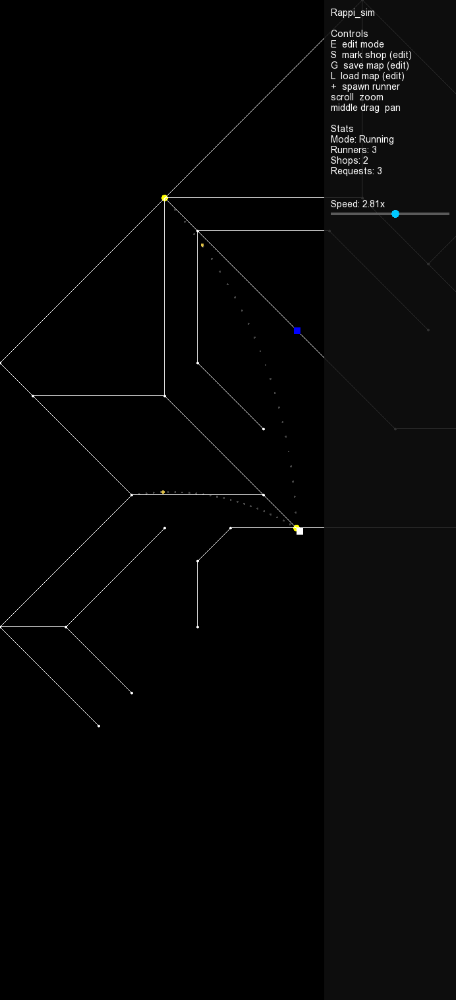

# Rappi_sim

A small delivery-courier simulation, named after [Rappi](https://www.rappi.com/), the
Latin American delivery app. Runners wander a node-and-street city graph. Shops
periodically place delivery requests; the nearest idle runner is dispatched to the shop,
picks up the package, and takes the shortest path (Dijkstra) to the destination.



## Features

- **Start menu** — pick which city to load from a "Load Map" button; every `.map` file in
  `maps/` shows up automatically.
- **A real map editor** — add nodes, connect/disconnect them, drag them around, snap to a
  grid, or bulk-generate a fresh grid, all without leaving the app.
- **Tiered streets** — a connection can be Normal, Long (10x), or Very Long (100x) the
  distance it looks on screen. Drawing that to scale would blow the map up, so instead
  it's color-coded (white/orange/red) and crossed proportionally slower — and routing
  (`findPath`) treats it as genuinely farther, not just visually shorter.
- **Real routing** — deliveries follow an actual shortest path over the street graph
  (`src/pathfinding.cpp`), not a straight line or a random walk.
- **Live status at a glance** — idle runners are green, runners fulfilling an order are
  blue; a pending order shows as a dim dotted curve from the shop to its destination, and
  turns into a blue curve drawn live from the runner once picked up.
- **A HUD sidebar** with the control legend, runner/shop/request counts, and a draggable
  slider to scale every runner's speed in real time.
- **Free camera** — scroll to zoom (anchored under the cursor), middle-click drag to pan.

## Build & run

Requires SFML 2.5:

```bash
sudo apt-get install libsfml-dev
make
./rappi_sim
```

## Controls

On launch, click **Load Map** and pick a city to start. In the simulation:

| Key / input                    | Effect                                              |
|----------------------------------|--------------------------------------------------------|
| `E`                             | Toggle edit mode (pauses the simulation)               |
| Left click (edit mode)          | Select a node, or click empty space to add a new one   |
| Left-click-drag (edit mode)     | Move the selected node (streets follow live)           |
| Shift+click a second node (edit mode) | Connect it to the selected node, or disconnect if already connected |
| `1` / `2` / `3` (edit mode)     | Set the tier for new connections: Normal/Long/Very Long |
| `N` (edit mode)                 | Toggle grid snap (25px) for placing/dragging nodes      |
| `+` / `-` (edit mode)           | Grow/shrink the pending bulk-generate grid size         |
| `C` (edit mode)                 | Generate a fresh grid at that size, replacing the map   |
| `S` (edit mode, node selected)  | Mark the selected node as a shop                        |
| `G` (edit mode)                 | Save the current city to `maps/new_city.map`            |
| `L` (edit mode)                 | Reload the current city from disk                       |
| Mouse wheel                     | Zoom in/out, centered on the cursor                     |
| Middle-click drag                | Pan the view                                           |
| `+` (not in edit mode)           | Spawn a new runner at a random node                    |
| Speed slider (sidebar)          | Drag to scale every runner's movement speed live        |

## How a delivery happens

1. A shop rolls the dice each frame (`requestProbability`) and, on a hit, creates a
   `Request` with a random destination node.
2. The nearest idle runner (straight-line distance) is dispatched: `findPath` computes the
   route to the shop, and the runner walks it one node at a time.
3. On arrival, the runner "picks up" the package, `findPath` computes a fresh route to the
   destination, and the request's visualization switches to the blue in-transit style.
4. On arrival at the destination, the request is marked satisfied and pruned from the
   request list; the runner goes back to idle wandering.

## Project layout

```
src/        buildCity.cpp, draw.cpp, main.cpp, pathfinding.cpp, struct.cpp
include/    corresponding headers
maps/       city graphs (.map) plus the lion_city source files (.svg/.ods)
assets/     arial.ttf, screenshot.png
```

See [ToDo.md](ToDo.md) for known gaps.
